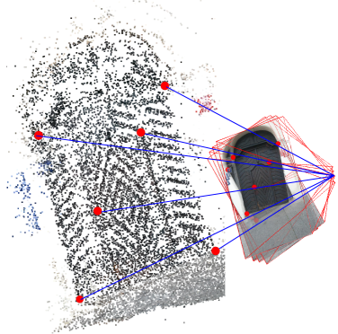

# RnP
Algorithms for computing the rolling shutter absolute camera pose. 

More specifically:
* **R6P** - computes calibrated RS camera pose and velocity from 6 3D<->2D correspondences
* **R7Pf** - computes RS camera pose and focal length from 7 3D<->2D correspondences
* **R7Pfr** - computes RS camera pose, focal length and radial distortion from 7 3D<->2D correspondences

For more details please see below.

The algorithms are available in the following languages:

* **C++** (all algorithms)
* **Python** (all algorithms via C++ bindings, R6PIter also in pure Python)
* **Matlab** (R6P1Lin via MEX, R7Pf and R7Pfr also in pure Matlab)

## How it works
The provided solvers compute parameters that describe the absolute pose of a RS camera. In addition to perspective camera parameters the solvers also compute the rotational and translational velocity of the camera.

## Projections models

There are two models that are used and returned by the solvers.

### Double linearized model

Is described by equation

    alpha * [x; (1 + rd * ||x||^2); 1] = K * [(I + (r - r_0) * [w]_x) * (I + [v]_x) * X | C_0 + (r - r_0) * t]

### Single linearized model

Is described by equation

    alpha * [x; (1 + rd * ||x||^2); 1] = K * [(I + (r - r_0) * [w]_x) * R_0 * X | C_0 + (r - r_0) * t]

Where  
- X : 3D point coordinates (3-vector)
- u : 2D point coorindates (2-vector)
- rd : coefficient of a single parameter radial distortion division model
- C : camera center
- R_0 : camera orientation as a rotation matrix
- v : linearized camera orientation parameters as a 3-vector of a first order Taylor expansion of the camera orientation matrix
- w : camera rotational velocity as a 3-vector of a first order Taylor expansion
- t : camera linear translational velocity
- K : camera calibration matrix as diag(f,f,1)
- r : the row or column coordinate of the 2D projection x, depending which direction the shutter is rolling
- r0 : linearization point of the camera motion
- alpha : perspective depth
- [*]_x is the skew-symmetric matrix of *
- I is an identity matrix

Please see [1] for more detailed description.

## Usage

Input to the algorithms are either 6 or 7 2D<->3D corredpondences, depending on the algorithm. The output are N solutions for the camera parameters.

### Input
C++ example:
    int num_corresp = 6;
    Eigen::MatrixXd X = Eigen::MatrixXd::Random(3,num_corresp);
    Eigen::MatrixXd u = Eigen::MatrixXd::Random(2,num_corresp);

## Installation
The library can be compiled with CMake. This will produce the static C++ library, if you want Python or MATLAB bindings see below. The Python bindings are produced thanks to the amazing library [Pybind](https://github.com/pybind/pybind11) which is included as a submodule. 

Follow the classic procedure:  

    git clone https://github.com/CenekAlbl/RnP.git
    cd RnP
    git submodule update --init --recursive
    mkdir build
    cd build
    cmake ..
    make

Since the compilation with optimizations can take very long, we recommend trying DEBUG version first:

    cmake .. -DCMAKE_BUILD_TYPE=DEBUG

After a successful compilation, we recommend to run the tests:

    make test

You can also run the benchmark to see the runtime of each algorithm on your machine:

    ./benchmark

Naturally, you should do it after compilation in the default RELEASE mode, not DEBUG.

### Python bindings

If you want to compile with Python bindings then:

    cmake .. -DPYTHON_BINDINGS=1

If you want to compile with MATLAB bindings then:

    cmake .. -DMATLAB_BINDINGS=1

It tries to find Matlab and Python automatically. If it fails to find yours or you want to specify a different version to be used, try:

    -DMatlab_ROOT_DIR=/path/to/your/matlab/folder 

or:

    -DPython_EXECUTABLE=/path/to/your/python/binary

## Usage

For an example how to use the algorithms take a look in the folder tests or in c++/benchmark.cpp.

## R7P
This is the 7 point version for cameras with unknown intrinsics. There are 2 algorithms:
* R7Pf - computes the camera pose + velocity + the focal length
* R7Pfr - computes the camera pose + velocity + the focal length and radial distortion  

The algorithms were presented in:  

[1] Z. Kukelova, C. Albl, A. Sugimoto, K. Schindler, T. Pajdla, "Minimal Rolling Shutter Absolute Pose with Unknown Focal Length and Radial", *European Conference on Computer Vision (ECCV)* 2020

## R6P1lin
This is the single-linearized standalone RS absolute pose solver presented in:

[2] C. Albl, Z. Kukelova, V. Larsson and T. Pajdla, "Rolling Shutter Camera Absolute Pose," in *IEEE Transactions on Pattern Analysis and Machine Intelligence*, 2019.

## R6P2lin
This is the double-linearized RS absolute pose solver that needs an initial camera orientation estimate also presented in:

[3] C. Albl, Z. Kukelova, V. Larsson and T. Pajdla, "Rolling Shutter Camera Absolute Pose," in *IEEE Transactions on Pattern Analysis and Machine Intelligence*, 2019.

which solves the same equations, but faster than the original:

[4] C. Albl, Z. Kukelova and T. Pajdla, "R6P - Rolling shutter absolute pose problem," *2015 IEEE Conference on Computer Vision and Pattern Recognition (CVPR)*, 2015.

## R6PIter
This is the iterative version of R6P-2lin that needs an initial camera orientation estimate and was presented in:

[5] Kukelova Z., Albl C., Sugimoto A., Pajdla T. Linear Solution to the Minimal Absolute Pose Rolling Shutter Problem. *Asian Conference on Computer Vision*, 2018.

